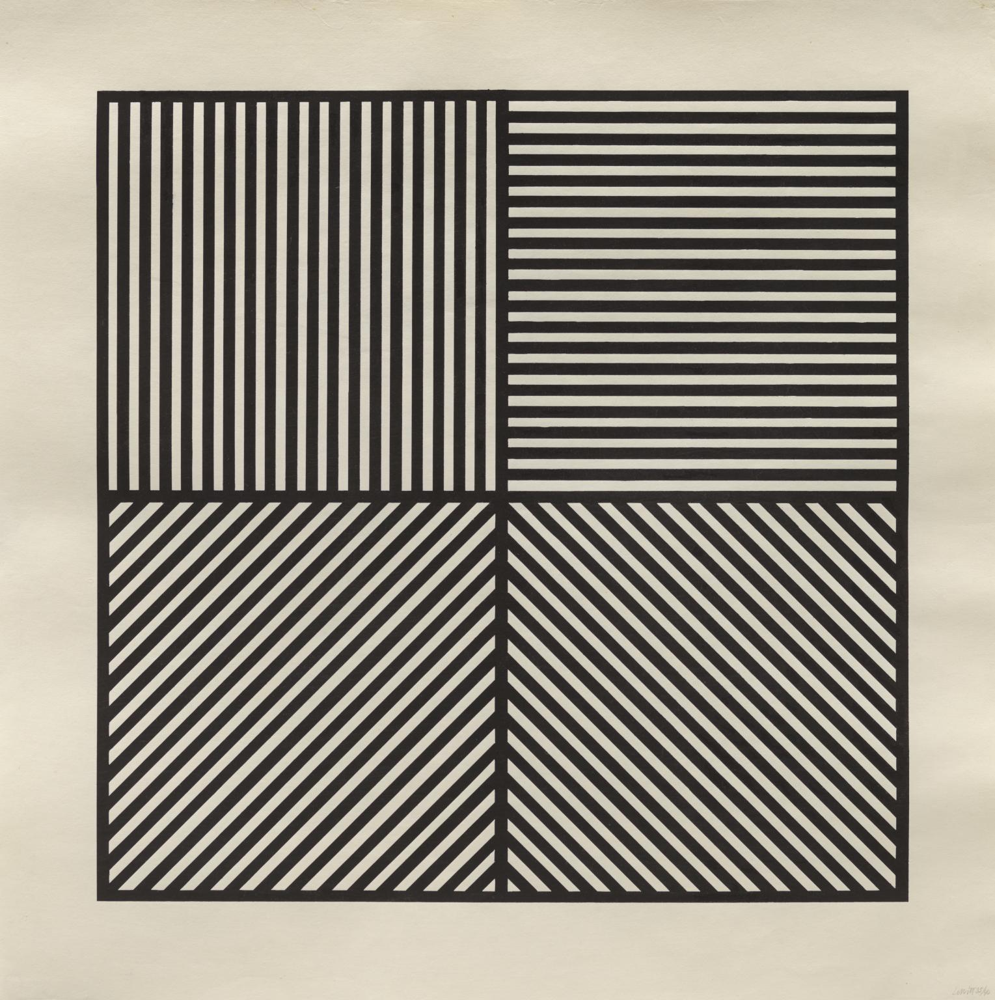

## Obra de Arte - P5

**"Wall Drawing. Sol LeWitt, 1968-1992"**

Fonte: [Museu Tàpies – Sol LeWitt: Drawings 1958–1992](https://museutapies.org/en/exposicio/sol-lewitt-drawings-1958-1992/)

---

## Sobre a obra

*Wall Drawing* faz parte da série de desenhos murais de Sol LeWitt, um dos principais nomes do Minimalismo e da Arte Conceitual. A obra é composta por quatro quadrantes com listras em direções distintas (vertical, horizontal e duas diagonais opostas). LeWitt explorava sistemas e instruções geométricas simples que, combinadas, geram composições visualmente complexas e com forte efeito óptico.

---

## Animação

Ao **clicar na obra**, as listras de todos os quadrantes deslizam simultaneamente em loop por **5 segundos**, criando uma ilusão de movimento contínuo que reforça o efeito óptico da composição. Após o término, a obra retorna ao estado estático.

Uma mensagem "clique na obra para animar" é exibida abaixo da obra antes da interação e desaparece após o clique.

---

## Arquivos

| Arquivo | Descrição |
|---|---|
| `index.html` | Estrutura da página |
| `DiegoFigueiredo.js` | Sketch em p5.js com a obra e animação |
| `obra_sol.jpg` | Imagem de referência da pintura |

---

## Tecnologia

- [p5.js](https://p5js.org/) v1.9.0